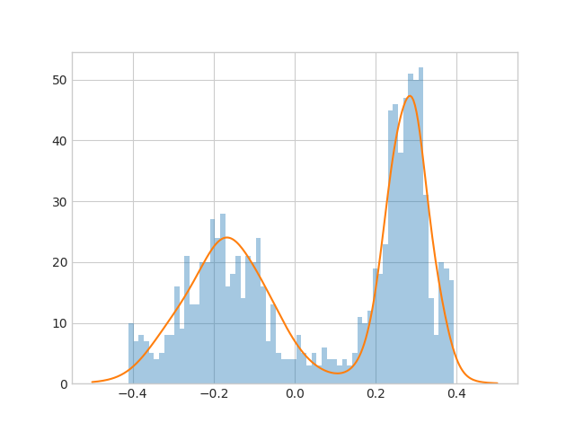

# Learning Cumulative Distribution Function with Neural Networks 
Here is a implementation of the new technique for density estimation with neural networks.

This model Learns cumulative distribution function with a *[Monotonic Networks (J. Sill, NIPS1997)](https://papers.nips.cc/paper/1358-monotonic-networks)*.

## 1d Gaussian


## Truncated 1d Gaussian


## Mixture of 2d Gaussians


## Truncated 2d Gaussians


## Run
```
train.py --gpu 0 --dataset gaussian_1d
```
```
train.py --gpu 0 --dataset gaussian_mix_2d
```

# Sampling
You can also use this technique to sampling from the distribution by learning inverse of the model.

## 1d Mixed Gaussian
```
train.py --gpu 0 --dataset gaussian_mix_1d --resume result/forward_snapshot_epoch_100 --mode inverse
```



Learned distribution(orange line), sampled data from learned model(blue bars).

## 2d Mixed Gaussian
```
train.py --gpu 0 --dataset gaussian_mix_2d --resume result/forward_snapshot_epoch_100 --mode inverse
```


Original data(left), learned distribution(center), sampled data from learned model(right).
